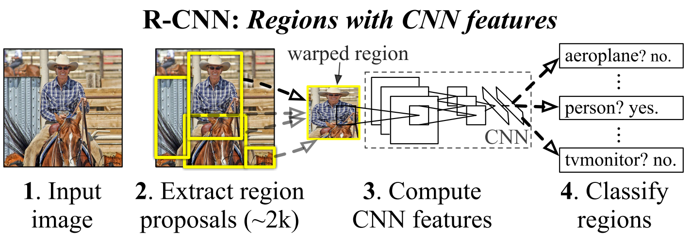

# [Rich feature hierarchies for accurate object detection and semantic segmentation](https://arxiv.org/abs/1311.2524)

Date: 11/11/2013  
Tags: task.object_detection, task.semantic_segmentation

- The authors are motivated to create a simple and scalable detection algorithm, in comparison to previous best-performing methods that are complex ensemble systems.
- Their approach combines two key insights:
    1. CNNs can be applied to bottom up region proposals to localize and segment objects (past systems have relied on HOG-like features generated from region proposals).
    2. Supervised pre-training on a large auxiliary dataset (ILSVRC classification) followed by domain-specific fine-tuning on a small dataset (PASCAL) can yield a significant performance boost for object detection (~8 percentage points). 
- Their object detection system (R-CNN) consists of three modules:
    1. The first generates category-independent region proposals (they use selective search to enable comparison to prior approaches).
    2. The second is a large CNN that extracts fixed-length feature vectors from each region proposal. 
        1. They extract a 4096-dimensional feature vector from each region using an AlexNet implementation. This is fairly low-dimensional when compared with previous approaches (e.g. spatial pyramids with bag-of-visual-word encodings).
        2. They take a tight bounding box around each candidate region and warp it to the required input size for the CNN.
    3. The third is a set of class-specific linear SVMs that generate classification scores for the candidate regions.
- Training consists of a few tricks / details:
    - They pre-train on ILSVRC classification and fine-tune on PASCAL VOC for classification (this is for the CNN; there is a separate training stage for the SVMs).
    - During *CNN fine-tuning training*, they treat all region proposals with > 0.50 IoU with a ground-truth box as positives for the box's class and the rest as negatives. 
    - During *SVM training*, they treat all region proposals with > 0.30 IoU with a ground-truth box as positives for the box's class, which was found through grid-search on the validation set. They use only hard negative mining for negatives.
    - They uniformly sample 32 positive windows (over all classes) and 96 background windows to construct each mini-batch (i.e. ratio of 3:1 negative:positive).
- They evaluate their method on VOC 2010 and ILSVRC 2013 (to compare to Overfeat) for detection, and VOC 2011 for semantic segmentation:
    - On VOC 2010, they set SOTA by nearly 25% in terms of mean average precision on the test set.
    - On ILSVRC 2013, they also set SOTA by roughly 30% in terms of mean average precision.
    - On VOC 2011, they achieve the highest segmentation accuracy for 11 / 21 categories, and they set SOTA for the highest overall segmentation accuracy. 
- In performing ablation experiments and visualizing modes of error, they find that a significant portion of errors were localization errors. To reduce these, they train a bounding-box linear regression model that predicts a new detection window given the pooled features for a selective search region.
    - It effectively predicts the center point (x, y) of the ground truth bounding box as well as the width and height.

## RCNN

