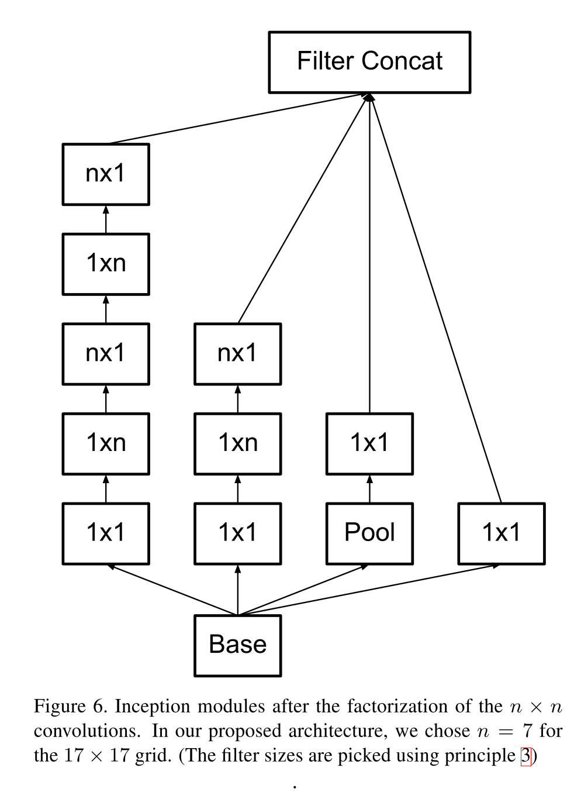
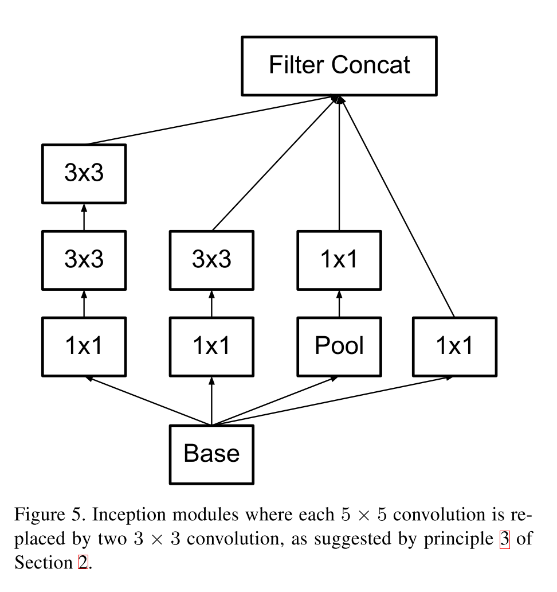
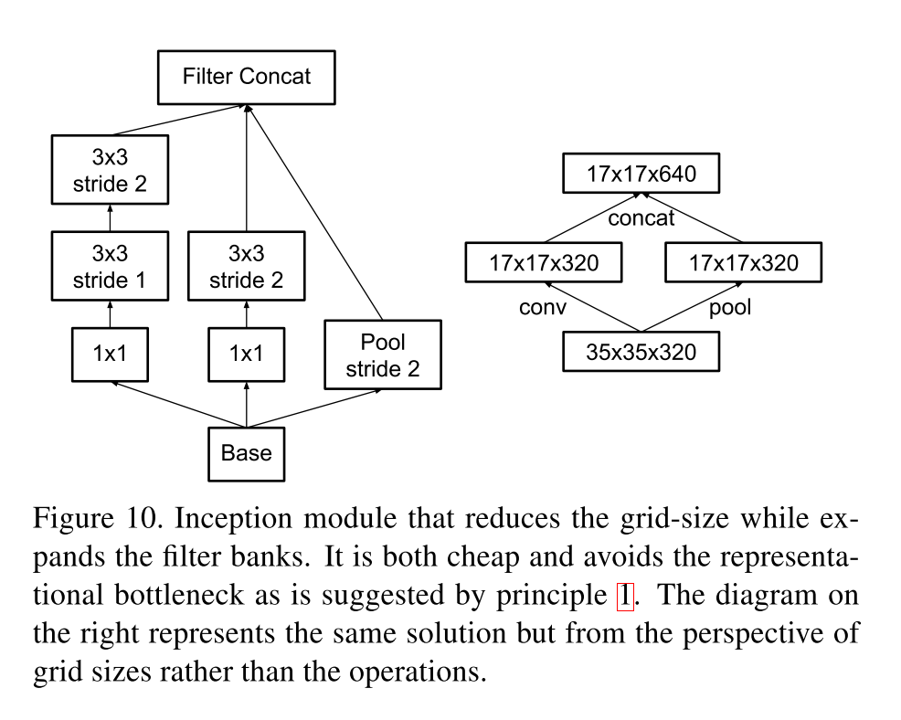

# [Rethinking the Inception Architecture for Computer Vision](https://arxiv.org/abs/1512.00567)

Date: 2/12/2015  
Tags: task.object_classification  

- The authors are motivated to scale up neural network size in ways that aim at utilizing the added computation as efficiently as possible
- The authors propose and discuss several design principles that help scale up neural networks efficiently, and that they use to guide the design of their networks, Inception V2 and Inception V3
    - Avoid representational bottlenecks, especially early in the network
    - Higher dimensional representations are easier to process locally within a network; increasing the number of activations for tiles leads to more disentangled features, which helps the network to train more quickly
    - Spatial aggregation can be done over low dimensional embeddings without much or any loss in representational power
        - They hypothesize that the reason for this is that there is a strong correlation between adjacent units, which results in much less loss of information during dimensionality reduction in a spatial aggregation context
    - Balance the width and depth of the network
    - Factorize larger convolutions into multiple smaller ones (e.g. a 5x5 into two 3x3 convolutions)
        - This can save ~28% in computation
    - Spatial factorization into asymmetric convolutions, e.g. a 3x3 convolution into a sequence of a 3x1 convolution and a 1x3 convolution
        - This can save ~33% in computation
    - Efficient grid size reduction to avoid a representational bottleneck when reducing dimensionality (e.g. through pooling), achieved through two parallel stride 2 blocks
- They test their proposed techniques on ImageNet, and achieve SOTA
- Through training / experimentation, the authors note:
    - When factorizing a larger convolution into two smaller ones (e.g. a 5x5 into two 3x3 convolutions), using ReLU activations for both convolutions works better than using a linear + ReLU activation
    - Factorizing smaller convolutions into asymmetric convolutions (e.g. a 3x3 into a 3x1 followed by a 1x3) does not work well on early layers, but it gives good results on medium grid-sizes, e.g. m x m where m ranges from 12 to 20
    - Removing the lower auxiliary branch did not have any adverse effect on the final quality of the network, and the auxiliary branches did not lead to differences in the convergence path early on in training
        - They argue that the auxiliary classifiers act as regularizers
    - Using label smoothing regularization improves model performance by about 0.2%

## Factorization into smaller convolutions

## Spatial Factorization into asymmetric convolutions

## Efficient grid size reduction

