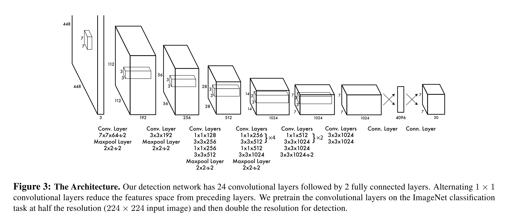

# [You Only Look Once: Unified, Real-Time Object Detection](https://arxiv.org/abs/1506.02640)

Date: 06/08/2015  
Tags: task.object_detection

- The authors are motivated to build a single neural network that [in one pass] predicts bounding boxes and class probabilities directly from full images
    - They want to avoid a complex pipeline that has many steps and is thus slow and hard to optimize (partially because each component has to be trained separately)
- They propose an approach where a single convolutional network simultaneously predicts multiple bounding boxes and class probabilities for those boxes (YOLO)
    - This makes YOLO extremely fast, since it is a single network instead of a complex, multi-network pipeline
    - YOLO reasons globally about the image, since it takes as input the entire image. 
        - This is in contrast to other sliding window or proposal-based techniques.
        - This allows it to make less than half the number of background errors as detection approaches (e.g. Fast R-CNN)
    - YOLO learns generalizable representations of objects
- Their system works by: 
    1. Dividing the entire image into an SxS grid.
    2. If the center of an object falls into a grid cell, that grid cell is responsible for detecting that object.
    3. Each grid cell predicts B bounding boxes and confidence scores for those boxes, where the confidence score reflects how confident the model is that the box contains an object and how accurate it thinks the box is that it predicts.
        - Bounding boxes are predicted using an (x, y) center relative to the bounds of the grid cell and the (width, height) that are relative to the whole image (they normalize the bounding box width and height by the image width and height to get it to fall between 0 and 1)
        - The class probabilities that each grid cell predicts are conditioned on the grid cell containing any object
        - The bounding box predictor that has the highest current IOU with the ground truth is "responsible" for predicting an object
- The architecture that they use is inspired by the GoogLeNet model for image classification, and has 24 convolutional layers followed by 2 fully connected layers (although they also release a Fast YOLO that is much smaller)
    - They use a linear activation for the final layer and all other layers use a leaky ReLU with alpha equal to 0.1
    - They use L2 loss on the bounding box coordinates, but weight the loss from bounding box coordinates much higher (~10x) relative to the confidence predictions for boxes that don't contain objects
    - To try to address that the error metric should reflect that small deviations in larger boxes aren't a big deal relative to small deviations in small boxes, they predict the square root of the bounding box width and height instead of the width and height directly
    - The loss function only penalizes classification error if an object is present in that grid cell
- In training / evaluating their system on VOC 2007 & 2012, the Picasso and People-Art datasets, they note: 
    - It is significantly faster than other systems - the only other systems they claim are "real-time detectors" are a deformable parts model (YOLO VGG and all variants of Fast / Faster R-CNN are not)
        - Fast YOLO runs at 155 FPS, and regular YOLO runs at 45 FPS
    - YOLO struggles to localize objects correctly. Localization errors account for more of YOLO's error than all other sources combined (Fast R-CNN makes much fewer localization errors, but far more background errors).
        - Because Fast R-CNN and YOLO make different errors, they find that performance of FastR-CNN improves by about ~5% (relative improvement) when combined with YOLO (in a way where the boost the bounding box from R-CNN if there is heavy overlap and the probabilitiy predicted by YOLO is high)
    - YOLO in aggregate performs worse than other detection systems
    - Their approach generalizes well to the Picasso and People-Art datasets

## YOLO Architecture

