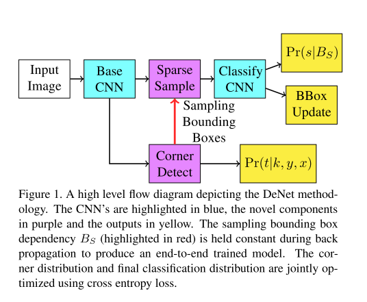

# [DeNet: Scalable Real-time Object Detection with Directed Sparse Sampling](https://arxiv.org/abs/1703.10295)

Date: 03/30/2017  
Tags: task.object_detection

- The authors are motivated to obtain the best detection performance at a predefined evaluation rate (i.e. 60 Hz and 30 Hz), as opposed to focusing on obtaining state-of-the-art accuracy in a competition environment
- The authors propose a convolutionally based detection model, where the input is an image and the output is a corner probability distribution for the image along with classification scores and bounding box coordinates for proposed bounding boxes. The pieces work as follows:
    1. Corner Detector: The likelihood that each position in the image contains an instance of one of 4 corner types (i.e. top left, top right, bottom left, bottom right) is estimated. This is estimated via some base convolutional network (e.g. ResNet-34 or ResNet-101) where some of the final layers are removed (e.g. the final mean pooling and fully connected layers) and deconvolutional layers are added instead (they use two).
        - They experiment with a version here that includes skip connections between the downsampling and deconvolution layers
    2. Directed Sparse Sampling: A sparse layer is run on top of the corner detector output to generate a set of sampling bounding boxes (RoIs). These sampling bounding boxes are generated via the following method:
        1. Search the corner distribution for all possible locations that are higher than some threshold.
        2. For each corner type, select some number of the corners with the highest likelihood.
        3. From those most likely corners, generate possible bounding boxes from all possible combos of (top-left, bottom-right) and (bottom-left, top-right).
        4. Calculate the probability of each bounding box being null using a Naive Bayesian classifier (i.e. taking the product of the probability of each corner location being a corner).
        5. Sort the bounding boxes by the probability that they are null and choose some number of those that have the highest probability of having an object.
    3. Feature Extraction: The RoIs from the sampling bounding boxes are used to extract a set of NxN feature vectors from the feature sampling maps. These feature vectors are constructed by extracting the nearest neighbor sampling features associated with a 7x7 grid plus the bounding box width and height.
    4. Classification Network: The feature vectors are propagated through a relatively shallow fully connected network to generate the final classification and fine tuned bounding box for each sampling RoI.
- In terms of training / setup:
    - The loss function is jointly optimized over the corner probability distribution (using cross-entropy), final classification distribution (using cross-entropy), and bounding box regression cost functions (using soft L1). They perform hyperparamter searches over the weights for each of these.
    - The regression target bounding box is identified by selecting the ground truth bounding box with the largest IoU overlap
- They test their proposed method on PASCAL VOC 2007, PASCAL VOC2012, and MSCOCO
    - On all datasets, they perform reasonably well in terms of overall MAP metrics
        - They perform better than some "top-performing" methods but worse than others in terms of just MAP
        - At MAP for a given evaluation rate (in Hz), they perform quite well because they perform comparably or better in MAP but at much higher evaluation rates (on average - there are one or two instances where this isn't quite true)
    - On PASCAL VOC 2007, they find that networks like RPN (with VGG backbone) and R-FCN provide better coverage at low IoU thresholds with a fixed number of proposals (300), but that DeNet provides better coverage at higher IoUs
- Through experiments, they note that the skip layer variants of their models improve performance for small and medium sized objects

## DeNet Architecture

