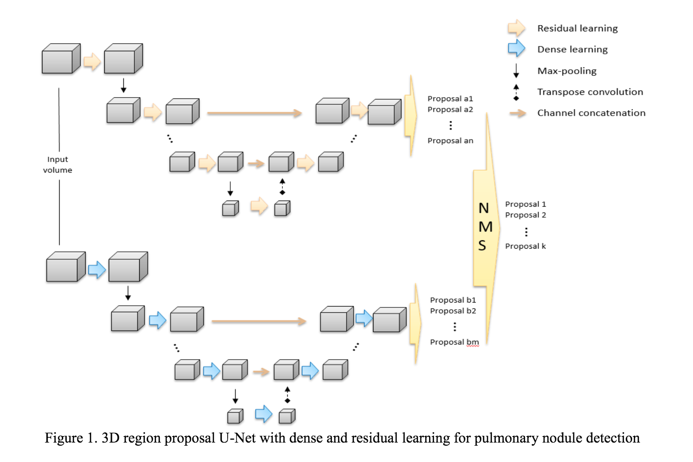

# [3D Region Proposal U-Net with Dense and Residual Learning for Lung Nodule Detection](http://luna16.grand-challenge.org/serve/public_html/pdfs/20171011_032308_report_Xie.pdf/)

Date: 09/29/2017  
Tags: task.object_detection, domain.medical

- The authors are motivated to develop a state-of-the-art nodule detection system using a single network for end-to-end detection as opposed to the more traditional multi-stage approaches
- The authors propose a 3D region proposal U-Net with dense and residual learning
    - The network takes as input a 3D patch extracted from the scan (using a sliding window approach over the lung) and outputs nodule detections (the details are light here, so it's unclear exactly how this happens). 
        - This input patch is fed to 2 separate U-Net branches (one with densenet style learning and the other with residual network style learning). Their proposals are combined afterwords, at which point non-maximum supression is run.
    - The scan is pre-processed to mask out areas that do not include the lung
- They test their method using the LUNA challenge data and achieve an average FROC of 0.9226 (5th place at the time of writing)

## 3D Region Proposal U-Net

