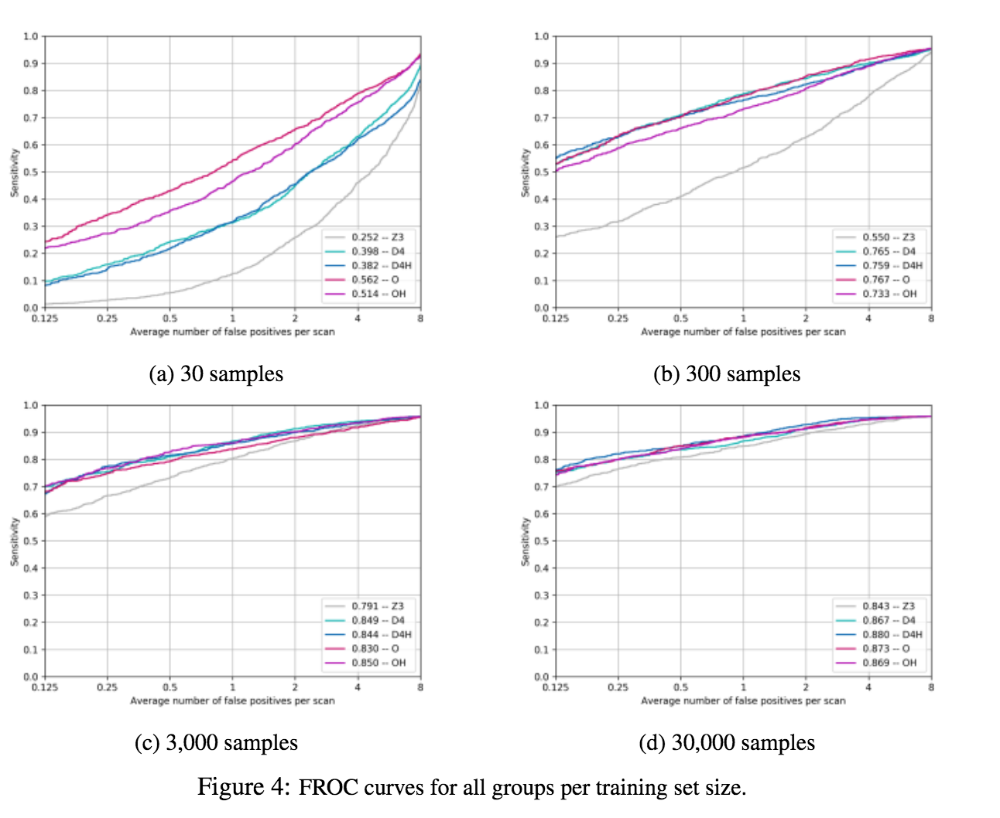

# [3D G-CNNs for Pulmonary Nodule Detection](https://arxiv.org/abs/1804.04656)

Date: 04/12/2018  
Tags: task.object_classification, domain.medical, topic.group_convolutions

- The authors are motivated to apply group convolutions to CNNs and demonstrate their effectiveness in the medical domain, where annotated data is scarce
- The authors propose a fairly basic convolutional neural network for nodule classification, but substitute group convolutions
    - They focus only on symmetry groups that are of use in 3D CNNS
    - The group convolutions that they propose using are those that are orientation-preserving and non-orientation preserving symmetries of a rectangular cuboid (D_4 and D_4h) and of a cube (O and O_h)
- They test their proposed method using the National Lung Cancer Screening Trial (NLST) data for training and the LIDC (Lung Image Database Consortium) for testing, classifying nodule candidates as true nodules or false positives
    - They use an equivalent CNN without group convolutions as a baseline, and make necessary adjustments to the size of the tested G-CNNs to ensure that they have roughly the same number of parameters as the baseline
    - They evaluate using the LUNA criteria (i.e. average FROC over 7 false candidate levels), and find that the G-CNNs regularly outperform the baseline (using regular convolutions) when trained on the same training set, but also outperform the baseline that is trained on 10x the data
- Through experiments, they note: 
    - There are negligible variations in the performance of using the different symmetry groups, minus the scenario where the training set size is 30
    - During training, G-CNNs seem to require fewer epochs to converge, often times only taking a few epochs to reach a validation loss that is better than the best validation loss achieved by the baseline
    - Each epoch of a G-CNN takes longer since the G-CNN has more 3D channels given a fixed parameter budget

## FROC Performance over training sizes and group convolutions

